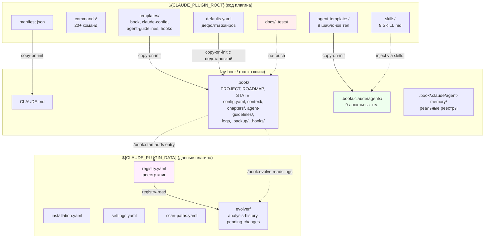

# Архитектурные схемы BookBench

> **Этот файл переработан 2026-05-05.** Главные изменения: схема (a) — двухуровневая → **трёхуровневая** (плагин код + плагин данные + книга); схема (b) — добавлена 9-я роль `book-tuner` (после главы — анализ замечаний и предложение правок гайдлайнов). ASCII-art адаптирован под опен-сорс README.

> **Уточнение 0.2.0.** Код плагина (`${CLAUDE_PLUGIN_ROOT}`) физически живёт в подпапке репозитория `plugins/bookbench/`, а не в корне репо (как было в 0.1.x). Это каноническая структура Claude Code marketplace, гарантирующая корректную работу `git-subdir`-источника. Для пользователя плагина внутреннее устройство `${CLAUDE_PLUGIN_ROOT}` не изменилось — корнем по-прежнему являются `commands/`, `skills/`, `agent-templates/`, `lib/`, `templates/`.

---

## Схема (a): Трёхуровневая модель — код плагина / данные плагина / папка книги

### ASCII-art

```
═══════════════════════════════════════════════════════════════════════════════════
        ┌────────────────────┐    ┌────────────────────┐    ┌────────────────────┐
        │ КОД ПЛАГИНА        │    │ ДАННЫЕ ПЛАГИНА     │    │ ПАПКА КНИГИ        │
        │ ${CLAUDE_PLUGIN_   │    │ ${CLAUDE_PLUGIN_   │    │ my-book/           │
        │  ROOT}             │    │  DATA}             │    │                    │
        │ (стирается при     │    │ (переживает        │    │ (собственность     │
        │  /plugin update)   │    │  /plugin update)   │    │  автора)           │
        └────────────────────┘    └────────────────────┘    └────────────────────┘
        
        ┌── manifest.json ──┐    ┌── installation ───┐    ┌── CLAUDE.md ─┐
        │ name, version     │    │ source: local-dev/│    │ инструкции   │
        │ commands, skills, │    │  github/marketplc │    │ для Claude   │
        │ slash:"book"      │    └───────────────────┘    └──────────────┘
        └───────────────────┘
                                  ┌── settings.yaml ──┐    ┌── .gitignore ┐
        ┌── commands/ ──────┐    │ default_genre,    │    │ inputs/, ... │
        │ /book:start       │    │ default_language  │    └──────────────┘
        │ /book:write-      │    └───────────────────┘
        │   chapter         │                              ┌── .book/ ────────────┐
        │ /book:guidelines  │    ┌── registry.yaml ──┐    │ PROJECT.md, ROADMAP  │
        │ /book:config      │    │ - my-book-2026... │    │ STATE.md, config.yaml│
        │ /book:tune        │ ── │ - dotu-2026...    │ ── │ INGEST-DECISIONS.md  │
        │ /book:list,       │    │ - ...             │    │ TUNING-LOG.md      ★ │
        │ /book:doctor,     │    │ (auto-add при     │    │ REJECTIONS-LOG.md  ★ │
        │ /book:register,   │    │  /book:start)     │    │ UPDATE-LOG.md      ★ │
        │ /book:archive,    │    └───────────────────┘    │                      │
        │ /book:forget      │                              │ ┌── context/ ──────┐ │
        │ /book:evolve [dev]│    ┌── scan-paths.yaml ┐    │ │ parameters       │ │
        │ ... (20+ команд)  │    │ ~/, ~/Documents/  │    │ │ voice-profile    │ │
        └───────────────────┘    │ ~/Projects/       │    │ │ glossary, ...    │ │
                                  │ (для /book:doctor)│    │ └──────────────────┘ │
        ┌── agent-templates/ ┐    └───────────────────┘    │                      │
        │ book-coordinator   │                              │ ┌── agent-          │
        │ book-strategist    │   ┌── evolver/ ──────┐    │ │   guidelines/  ★ │ │
        │ book-writer        │   │ analysis-history/│    │ │ coordinator/     │ │
        │ book-factchecker   │   │ pending-changes/ │    │ │ strategist/      │ │
        │ book-editor        │   └──────────────────┘    │ │   structural-... │ │
        │ book-marketer      │                            │ │ writer/          │ │
        │ book-doc-classifier│   ┌── cache/ ────────┐    │ │   voice-samples  │ │
        │ book-doc-synthesi  │   │ patterns.json    │    │ │   forbidden-...  │ │
        │ book-tuner    ★    │   └──────────────────┘    │ │ factchecker/     │ │
        └───────────────────┘                              │ │   trusted-srcs   │ │
                                                            │ │ editor/          │ │
        ┌── skills/ ────────┐                              │ │ marketer/        │ │
        │ base-methodology  │                              │ │ classifier/      │ │
        │ anti-ai-cliche    │                              │ │ synthesizer/     │ │
        │ voice-profile     │                              │ │ tuner/         ★ │ │
        │ factcheck-prot.   │                              │ └──────────────────┘ │
        │ marketing-prot.   │                              │                      │
        │ import-classif.   │                              │ ┌── chapters/<id>/ ┐ │
        │ import-synth.     │                              │ │ spec, draft,     │ │
        │ genre-researcher  │                              │ │ factcheck,       │ │
        │ genres/popular-   │                              │ │ edited,          │ │
        │   science         │                              │ │ marketing,       │ │
        └───────────────────┘                              │ │ summary          │ │
                                                            │ │ research/        │ │
        ┌── defaults.yaml ★ ┐                              │ │ v2/              │ │
        │ genres:           │                              │ └──────────────────┘ │
        │   popular-science:│                              │                      │
        │     writing: ...  │                              │ ┌── agent-memory/  ┐ │
        │     agents: ...   │                              │ │ <role>/README.md │ │
        │   fiction: ...    │                              │ │ (указатели)      │ │
        │   monograph: ...  │                              │ └──────────────────┘ │
        └───────────────────┘                              │                      │
                                                            │ ┌── intel/, debug/, │ │
        ┌── templates/ ─────┐                              │ │  inputs/, final/ │ │
        │ book/ (skeleton)  │ ── copy-on-init ──▶          │ └──────────────────┘ │
        │ claude-config/    │                              │                      │
        │ agent-guidelines/ │                              │ ┌── .hooks/        ─┐ │
        │   (минимальные)   │                              │ │ anti-ai-cliche-  │ │
        │ hooks/            │                              │ │ lint.sh          │ │
        │ claude-md/        │                              │ └──────────────────┘ │
        └───────────────────┘                              │                      │
                                                            │ ┌── .backup/      ★┐ │
        ┌── docs/, tests/ ──┐                              │ │ <YYYY-MM-DD-HHMM>│ │
        │ для опен-сорс     │                              │ └──────────────────┘ │
        └───────────────────┘                              │                      │
                                                            │ ┌── .claude/       ┐ │
                                                            │ │ settings.json    │ │
                                                            │ │ agents/  (9 L)   │ │
                                                            │ │   coordinator    │ │
                                                            │ │   strategist     │ │
                                                            │ │   writer         │ │
                                                            │ │   factchecker    │ │
                                                            │ │   editor         │ │
                                                            │ │   marketer       │ │
                                                            │ │   classifier     │ │
                                                            │ │   synthesizer    │ │
                                                            │ │   tuner       ★  │ │
                                                            │ │ agent-memory/    │ │
                                                            │ │   (реальные      │ │
                                                            │ │    реестры)      │ │
                                                            │ └──────────────────┘ │
                                                            └──────────────────────┘
        
                                                                ★ — новое 2026-05-05

        ┌── /plugin update ──┐  обновляет ТОЛЬКО код плагина:
        │ bookbench: 0.1→0.2 │  ── × (no-touch) ──▶  ${CLAUDE_PLUGIN_DATA}
        │                    │  ── × (no-touch) ──▶  все .book/ остаются нетронуты
        └────────────────────┘

        ┌── /plugin uninstall ┐  удаляет ${CLAUDE_PLUGIN_ROOT};
        │                     │  спрашивает: «сохранять ${CLAUDE_PLUGIN_DATA}?»
        │                     │  --keep-data: сохраняет автоматически
        │                     │  все .book/ остаются всегда (detach-режим)
        └─────────────────────┘

        ┌── /book:update ────┐  показывает 3-way merge:
        │ внутри книги       │  ── selective ──▶  .book/.claude/agents/  (9 L)
        │ сравнивает шаблоны │   с подтвержд.    .book/.hooks/anti-ai-cliche
        │ с локальными       │                   .book/agent-guidelines/  — НЕ трогает
        │ копиями            │                   .book/context/, chapters/  — НЕ трогает
        └────────────────────┘                   логи (TUNING/REJECTIONS/UPDATE) — НЕ трогает

        ┌── /book:start ─────┐  
        │                    │  ── add to ──▶  ${CLAUDE_PLUGIN_DATA}/registry.yaml
        │                    │  ── copy ──▶    9 тел в .book/.claude/agents/
        │                    │  ── copy ──▶    скелет .book/, гайдлайны (с дефолтами жанра)
        └────────────────────┘

        ┌── /book:evolve ────┐  читает TUNING-LOG.md из всех зарегистр. книг
        │ [только в local-   │  ── propose ──▶  ${CLAUDE_PLUGIN_DATA}/evolver/
        │  dev режиме]       │                  pending-changes/  (diff-файл)
        │                    │  ── apply ───▶   ${CLAUDE_PLUGIN_ROOT}/  + git commit
        │                    │  НИКОГДА не читает текст глав
        └────────────────────┘

        L = local subagent (.book/.claude/agents/  — все 9 ролей здесь, не в плагине)

═══════════════════════════════════════════════════════════════════════════════════
```

### Текстовое пояснение каждой стрелки

| # | Откуда → Куда | Тип взаимодействия | Когда происходит |
|---|---------------|---------------------|-------------------|
| 1 | `manifest.json` → `CLAUDE.md` | copy-on-init | `/book:start` (с merge) |
| 2 | `commands/` → пользователь | reads-only registration | при загрузке Claude Code |
| 3 | `agent-templates/` (9 шаблонов) → `.book/.claude/agents/` (9 копий) | copy-on-init | `/book:start` |
| 4 | `skills/**/SKILL.md` → контекст любого агента | injection через `skills:` | при старте Task |
| 5 | `defaults.yaml` (секция жанра) → `.book/config.yaml` + `.book/agent-guidelines/<role>/` | copy-on-init с подстановкой | `/book:start` (после выбора жанра) |
| 6 | `templates/` → `.book/` | copy-on-init | `/book:start` |
| 7 | `templates/agent-guidelines/` → `.book/agent-guidelines/` | copy-on-init с дефолтами жанра | `/book:start` |
| 8 | `templates/hooks/` → `.book/.hooks/` | copy-on-init | `/book:start` (chmod +x) |
| 9 | `docs/, tests/` → `.book/, .book/.claude/` | no-touch (×) | никогда |
| 10 | `installation.yaml` → видимость `/book:evolve` | runtime check | при загрузке `/book:help` |
| 11 | `/book:start` → `${CLAUDE_PLUGIN_DATA}/registry.yaml` | append-record | автоматически в конце `/book:start` |
| 12 | `/plugin update` → `${CLAUDE_PLUGIN_ROOT}/` | replace | заменяет код плагина |
| 13 | `/plugin update` → `${CLAUDE_PLUGIN_DATA}/` | **no-touch** (×) | гарантия Anthropic |
| 14 | `/plugin update` → папки книг | **no-touch** (×) | контракт совместимости |
| 15 | `/plugin uninstall` → `${CLAUDE_PLUGIN_DATA}/` | conditional | спрашивает пользователя; `--keep-data` сохраняет |
| 16 | `/book:update` → `.book/.claude/agents/`, `.book/.hooks/` | 3-way merge с подтверждением | внутри папки книги |
| 17 | `/book:update` → `.book/agent-guidelines/`, `.book/context/`, `.book/chapters/`, логи | **no-touch** (×) | никогда не трогает индивидуальность книги |
| 18 | `/book:update` → `.book/.backup/<timestamp>/` | snapshot before update | автоматически перед обновлением |
| 19 | `/book:update` → `.book/UPDATE-LOG.md` | append-only | после успешного обновления |
| 20 | `/book:tune` → `book-tuner` (Task) → `.book/agent-guidelines/<role>/` | suggested diff | внутри сессии работы над книгой |
| 21 | `/book:evolve propose` → `${CLAUDE_PLUGIN_DATA}/evolver/pending-changes/` | dry-run output | в local-dev |
| 22 | `/book:evolve apply` → `${CLAUDE_PLUGIN_ROOT}/...` + git commit | actual write | только в local-dev, с подтверждением |
| 23 | `/book:doctor` → `${CLAUDE_PLUGIN_DATA}/scan-paths.yaml` → файловая система | scan | по запросу пользователя |

### Mermaid-вариант (для этапа 16)



---

## Схема (b): Поток данных одного микро-цикла главы (с book-tuner)

### ASCII-art

```
═══════════════════════════════════════════════════════════════════════════════════

  ПОЛЬЗОВАТЕЛЬ                                              GATE (✋ — пользователь)
       │
       │ /book:write-chapter <N>
       ▼
  ┌────────────────────────────────────────────────────────────────────────────┐
  │  [book-coordinator]  (главный диалог в роли — agent: в settings.json)      │
  │                                                                            │
  │  Numbered Procedure:                                                       │
  │   1. Read .book/agent-guidelines/coordinator/README.md  ★                  │
  │   2. Read context (.book/ROADMAP.md, parameters.md, prev summary.md)       │
  │   3. Task(book-strategist) → spec.md                                       │
  │   4. ✋ ask user (approve spec.md)                                         │
  │   5. Task(book-writer) → draft.md                                          │
  │   6. Task(book-factchecker) → factcheck.md                                 │
  │   7. if BLOCKER → Task(book-writer revise) → draft.md (re-write)           │
  │      then Task(book-factchecker) → factcheck.md (re-check)                 │
  │      max 3 iterations; otherwise → escalate to user                        │
  │   8. Task(book-editor) → edited.md                                         │
  │   9. if editor changed facts → Task(book-factchecker re-check)             │
  │   10. Task(book-marketer) → marketing.md                                   │
  │   11. autogenerate summary.md from edited.md                               │
  │   12. update agent-memory/<role>/MEMORY.md per role                        │
  │   13. update STATE.md                                                      │
  │   14. ✋ финальный обзор главы                                             │
  │   15. (опционально) если автор переделал — append to REJECTIONS-LOG.md  ★  │
  └────────────────────────────────────────────────────────────────────────────┘
       │
       │  координатор последовательно вызывает 5 ролей цикла + опционально tuner
       │
       ▼
  ┌─────────────────────┐
  │ ФАЗА 1/5            │
  │ [book-strategist]   │ skills: base-methodology, popular-science-methodology
  │   tools: Read, Write│ memory: project
  │                     │
  │  Procedure:         │
  │  1. Read agent-     │ ── reads ──▶ .book/agent-guidelines/strategist/  ★
  │     guidelines/     │              README.md + structural-rules.md +
  │     strategist/  ★  │              chapter-checklist.md
  │  2. Read context    │ ── reads ──▶ ROADMAP.md, parameters.md,
  │  3. Write spec.md   │              red-thread-keywords.md, prev summary.md,
  │                     │              .book/.claude/agent-memory/strategist/
  │                     │
  │                     │ ── writes ──▶ chapters/<N>/spec.md
  └─────────────────────┘
       │
       │ ✋ approve spec.md
       ▼
  ┌─────────────────────┐
  │ ФАЗА 2/5            │
  │ [book-writer]       │ skills: base-methodology, popular-science-methodology,
  │   tools: Read, Write│         anti-ai-cliche, voice-profile
  │   hooks: PostToolUse│ memory: project
  │                     │
  │  Procedure:         │
  │  1. Read agent-     │ ── reads ──▶ .book/agent-guidelines/writer/  ★
  │     guidelines/     │              README + voice-samples.md + 
  │     writer/  ★      │              forbidden-phrases.md + favorite-metaphors.md
  │  2. Read spec.md    │
  │  3. Write draft.md  │ ── hook on every Write/Edit ──▶ .book/.hooks/
  │                     │     anti-ai-cliche-lint.sh
  │                     │     │
  │                     │     │ если найдены клише → блок exit code
  │                     │     │ → writer revise → новый Write → повторно hook
  │                     │     ▼
  │                     │ ── writes ──▶ chapters/<N>/draft.md
  └─────────────────────┘
       │
       ▼
  ┌─────────────────────┐
  │ ФАЗА 3/5            │
  │ [book-factchecker]  │ skills: factcheck-protocol
  │   tools: Read, Write│ memory: project
  │   WebSearch,WebFetch│ disallowedTools: Edit (адверсариальная стойка)
  │   mcpServers: ...   │
  │                     │
  │  Procedure:         │
  │  1. Read agent-     │ ── reads ──▶ .book/agent-guidelines/factchecker/  ★
  │     guidelines/     │              README + trusted-sources.md +
  │     factchecker/  ★ │              outdated-sources.md + claim-tags-rules.md
  │  2. Read draft.md   │
  │  3. Verify facts    │ + WebSearch / MCP калls для верификации
  │  4. Write factcheck │ ── writes ──▶ chapters/<N>/factcheck.md
  │     .md             │              (claim provenance: VERIFIED/CITED/
  │                     │               ASSUMED/OUTDATED/SPECULATIVE)
  └─────────────────────┘
       │
       │  if BLOCKER:
       │   ─── loop verification ──▶  Task(book-writer revise-mode)
       │                               max 3 iterations
       ▼
  ┌─────────────────────┐
  │ ФАЗА 4/5            │
  │ [book-editor]       │ skills: base-methodology, anti-ai-cliche
  │   tools: Read, Edit,│ memory: project
  │   Write             │ hooks: PostToolUse (двойной audit-pass)
  │                     │
  │  Procedure:         │
  │  1. Read agent-     │ ── reads ──▶ .book/agent-guidelines/editor/  ★
  │     guidelines/     │              README + cohesion-rules.md +
  │     editor/  ★      │              author-deviations.md
  │  2. Read draft +    │
  │     factcheck +     │
  │     prev edited     │
  │  3. Write edited.md │ ── hook ──▶ anti-ai-cliche-lint.sh
  │                     │ ── writes ──▶ chapters/<N>/edited.md
  └─────────────────────┘
       │
       │  if editor changed facts:
       │   ─── Task(book-factchecker re-check)
       ▼
  ┌─────────────────────┐
  │ ФАЗА 5/5            │
  │ [book-marketer]     │ skills: base-methodology, popular-science-methodology,
  │   tools: Read, Write│         marketing-protocol
  │                     │ memory: project
  │  Procedure:         │
  │  1. Read agent-     │ ── reads ──▶ .book/agent-guidelines/marketer/  ★
  │     guidelines/     │              README + brand-voice.md + telegram-tone.md
  │     marketer/  ★    │
  │  2. Read edited.md  │
  │  3. Write marketing │ ── writes ──▶ chapters/<N>/marketing.md
  └─────────────────────┘
       │
       ▼
  ┌─────────────────────────────────────────────┐
  │  [book-coordinator] — финализация            │
  │   ── writes ──▶ chapters/<N>/summary.md     │
  │   ── update ──▶ agent-memory/<role>/         │
  │                 MEMORY.md per role          │
  │   ── update ──▶ STATE.md                    │
  │   ── update ──▶ context/cross-references.md │
  │                                             │
  │   ✋ финальный обзор главы пользователю      │
  │                                             │
  │   if автор переделал:                       │
  │   ── append ──▶ REJECTIONS-LOG.md  ★        │
  └─────────────────────────────────────────────┘
       │
       ▼
  ✅ chapters/<N>/ готова: spec, draft, factcheck, edited, marketing, summary

  ┄┄┄┄┄┄┄┄┄┄┄┄┄┄┄┄┄┄┄┄┄┄┄┄┄┄┄┄┄┄┄┄┄┄┄┄┄┄┄┄┄┄┄┄┄┄┄┄┄┄┄┄┄┄┄┄┄┄┄┄┄┄┄┄┄┄┄┄┄┄┄┄

  ОПЦИОНАЛЬНО — ПОСЛЕ ГЛАВЫ (или после N глав):

       │ /book:tune
       ▼
  ┌─────────────────────┐
  │ [book-tuner]    ★   │ skills: base-methodology
  │   tools: Read, Write│ memory: project
  │                     │ disallowedTools: Edit, Bash, WebSearch, Task
  │  Procedure (наслед- │
  │  ует tuning-prompt- │
  │  example.md):       │
  │  1. Read agent-     │ ── reads ──▶ .book/agent-guidelines/tuner/  ★
  │     guidelines/     │              README + analysis-rules.md +
  │     tuner/  ★       │              sensitivity-thresholds.md
  │  2. Read TUNING-LOG │ ── reads ──▶ .book/TUNING-LOG.md
  │     + REJECTIONS-   │              .book/REJECTIONS-LOG.md
  │     LOG             │
  │  3. Read current    │ ── reads ──▶ .book/agent-guidelines/<всех ролей>/
  │     guidelines      │
  │  4. Find systemic   │
  │     patterns (≥3    │
  │     occurrences)    │
  │  5. Propose diffs   │ ── writes ──▶ stdout-предложения для пользователя
  │     in priority:    │              (критично / важно / опционально)
  │     critical,       │
  │     important,      │
  │     optional        │
  │  6. Confirm         │
  │     completeness    │
  │                     │
  │  /book:tune apply <id>:                                                ★
  │  координатор пишет diff в файл гайдлайна + запись в TUNING-LOG.md
  └─────────────────────┘

═══════════════════════════════════════════════════════════════════════════════════
```

### Текстовое пояснение стрелок цикла (с tuner)

#### Внутри-цикла стрелки (без изменений из первой версии)

| # | Откуда → Куда | Артефакт | Зачем |
|---|---------------|----------|-------|
| 1 | пользователь → координатор | `/book:write-chapter <N>` | старт цикла |
| 2 | strategist → `chapters/<N>/spec.md` | spec.md | ТЗ главы |
| 3 | координатор → пользователь | gate ✋ approve | пользовательский гейт |
| 4 | writer → `chapters/<N>/draft.md` | draft.md | драфт |
| 5 | writer (через hook) → anti-ai-cliche-lint.sh | каждый Write | блокирующая валидация |
| 6 | factchecker → WebSearch / MCP | каждое утверждение | верификация |
| 7 | factchecker → `chapters/<N>/factcheck.md` | factcheck.md | отчёт |
| 8 | координатор → writer revise (Task) | при BLOCKER | loop verification |
| 9 | editor → `chapters/<N>/edited.md` | edited.md | финальная редактура |
| 10 | координатор → factchecker re-check | если editor изменил факты | second loop |
| 11 | marketer → `chapters/<N>/marketing.md` | marketing.md | маркетинговая упаковка |
| 12 | координатор → `chapters/<N>/summary.md` | summary.md | сводка |
| 13 | координатор → memory: project per role | MEMORY.md | реестры уникальности |
| 14 | координатор → пользователь | финальный gate ✋ | обзор готовой главы |

#### Новые стрелки 2026-05-05

| # | Откуда → Куда | Артефакт | Зачем |
|---|---------------|----------|-------|
| 15 | каждый агент → `.book/agent-guidelines/<role>/` | first read | гайдлайн — обязательная часть `<files_to_read>` |
| 16 | координатор → `REJECTIONS-LOG.md` | после ручной переделки автора | вход для tuner |
| 17 | пользователь → координатор → tuner (Task) | `/book:tune` | анализ паттернов замечаний |
| 18 | tuner → stdout (предложения) | список diff с приоритизацией | пользователь решает применять или нет |
| 19 | координатор → `.book/agent-guidelines/<role>/<file>.md` + `TUNING-LOG.md` | при `/book:tune apply <id>` | применение правки гайдлайна |

#### Принципы потока (без изменений + новые)

1. Координатор оркестрирует, не пишет content (без изменений).
2. Никаких вложенных Task'ов (без изменений).
3. Изоляция контекста на каждой фазе (без изменений).
4. Файловый протокол (без изменений).
5. Loop verification только на адверсариальных парах (без изменений).
6. Hooks — последняя линия обороны (без изменений).
7. Гейты пользователя — только в 2 точках цикла (без изменений).
8. **(новое)** Каждый агент читает свой гайдлайн первым шагом — индивидуальность книги доставляется через гайдлайны, не через тело.
9. **(новое)** book-tuner — отдельный, **не часть микро-цикла главы**; вызывается опционально по запросу автора.
10. **(новое)** Tuner не правит сам — только предлагает; применение через `/book:tune apply <id>` идёт через координатора.

---

## Связи между схемами

| Концепт | Схема (a) | Схема (b) |
|---------|-----------|-----------|
| Все агенты local | средняя и правая колонки (data + book) | пометка [9 ролей в .book/.claude/agents/] |
| Universal Body + Local Guidelines | стрелки `agent-templates → .claude/agents` (тело) и `defaults → agent-guidelines` (индивидуальность) | стрелки «1. Read agent-guidelines/<role>/» в каждой фазе |
| `${CLAUDE_PLUGIN_DATA}` | средняя колонка | стрелка `/book:tune` → координатор + неявная связь через registry для evolver |
| 9 ролей субагентов | в `agent-templates/` плагина (шаблоны) + `.book/.claude/agents/` (копии) | 5 ролей цикла + 2 импорта (отдельный поток) + tuner (опциональный пост-цикл) |
| `memory: project` | `.book/.claude/agent-memory/` | пишется на финальной фазе координатором |
| `hooks` | `.book/.hooks/` | блокирующая валидация на writer/editor |
| `mcpServers` | factchecker как L-агент | WebSearch/MCP в фазе 3 |
| `permissionMode` | `.book/.claude/agents/book-coordinator.md` имеет `acceptEdits` | автономный прогон 5 фаз |
| Файловый протокол | контракт «не трогать .book/» при `/plugin update` | передача артефактов через файлы |
| Реестр книг | `${CLAUDE_PLUGIN_DATA}/registry.yaml` | косвенно — `/book:start` добавляет; `/book:evolve` читает |
| Tuner | в `agent-templates/book-tuner.md` (шаблон) + `.book/.claude/agents/book-tuner.md` (копия) | отдельная стрелка после цикла главы |
| Evolver | `/book:evolve` команда (видна только в local-dev); `${CLAUDE_PLUGIN_DATA}/evolver/` | не показан на схеме (b) — это меж-книжный поток, а не внутри одной книги |

---

## Заметки для будущих этапов

- **Этап 11 (микро-цикл главы)** дополняет схему (b) деталями: количественные ориентиры, Numbered Procedure координатора (~20 шагов), recovery from rule break. Также описывает, **когда именно** координатор предлагает запись в REJECTIONS-LOG.md (например, после явной правки автором отредактированного `edited.md`).
- **Этап 14 (имплементация)** реализует `book-tuner` (тело + дефолтные гайдлайны) и `bookbench-evolver` (dev-команда плагина).
- **Этап 16 (документация)** копирует обе схемы в `docs/architecture.md`. Mermaid-варианты — для расширенной документации. README может содержать упрощённую версию схемы (a) для опен-сорс аудитории.

---

*Этап: 06 «Архитектура плагина» — переработка 2026-05-05*
*Создан: 2026-05-04*
*Переработан: 2026-05-05*
